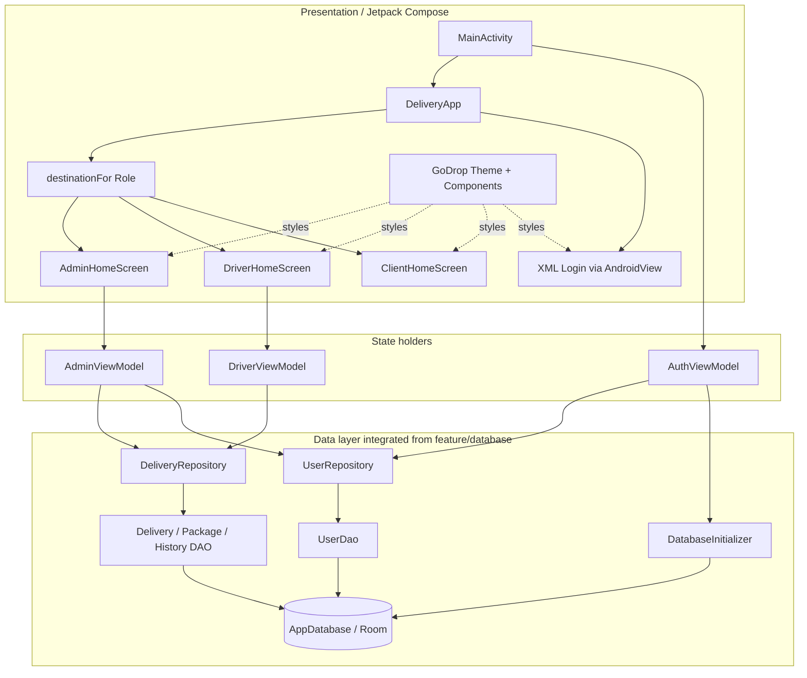

# Architecture — Core, authentication and role navigation

## Ranh giới trách nhiệm

- `feature/auth-navigation` sở hữu theme, shared component, Login, auth state và role routing.
- Các feature role sở hữu nội dung bên trong Home tương ứng.
- Data layer cung cấp repository/DAO; auth-navigation chỉ tích hợp qua interface hiện có,
  không định nghĩa lại Entity hoặc nghiệp vụ giao hàng.
