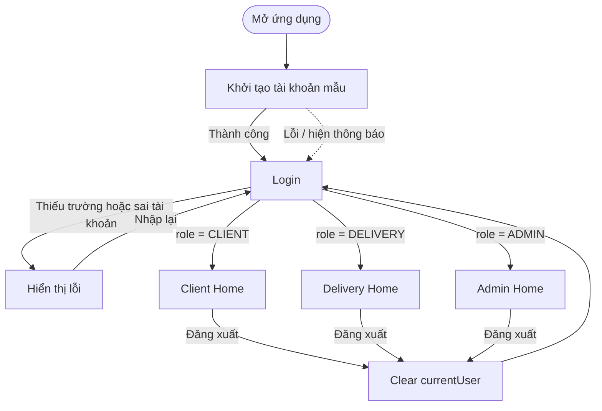

# SF-00 — Authentication and role navigation

## Mapping source

- `AuthViewModel`: trạng thái khởi tạo, login, logout.
- `destinationFor(Role?)`: ánh xạ role thành destination.
- `DeliveryApp`: render Login hoặc đúng Home.
- `DashboardScaffold`: shell chung của ba Home.
