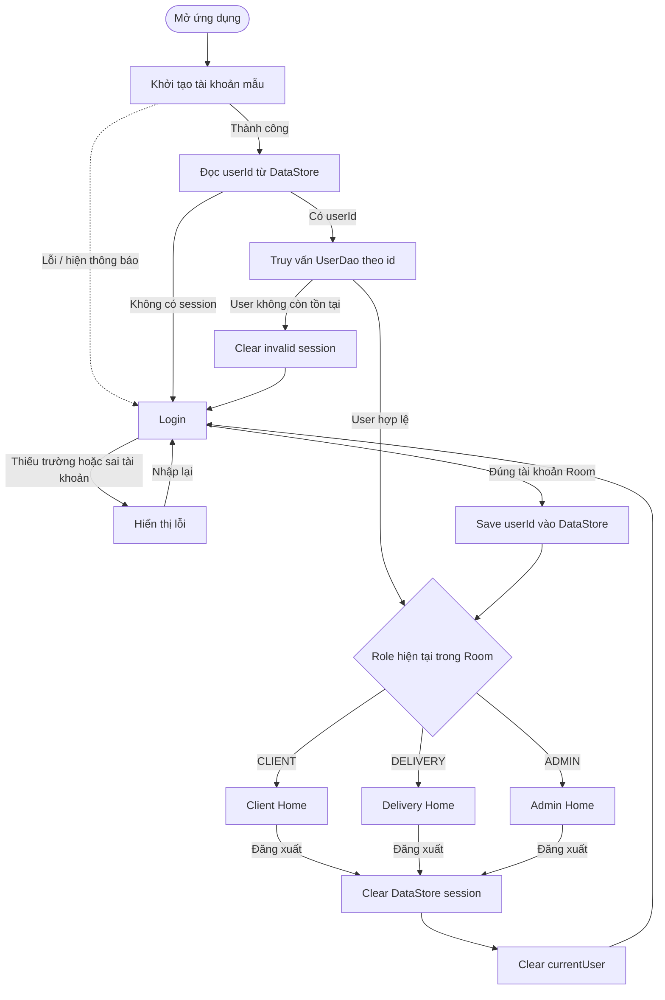

# SF-00 — Authentication and role navigation

## Mapping source

- `AuthViewModel`: khởi tạo, restore session, login và logout.
- `UserRepository`: login bằng `UserDao`, lưu/xóa session và kiểm tra invalid session.
- `DataStoreSessionStorage`: chỉ lưu `current_user_id`.
- `destinationFor(Role?)`: ánh xạ role thành destination.
- `DeliveryApp`: render Login hoặc đúng Home.
- `DashboardScaffold`: shell chung của ba Home.
