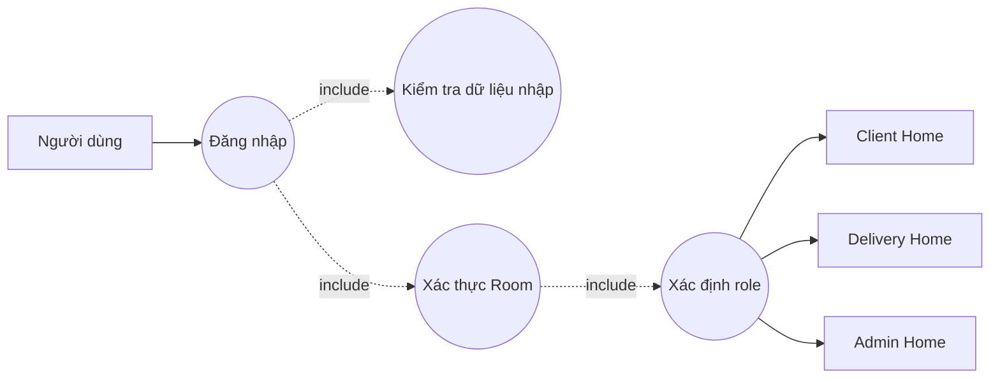

# UC-AUTH-01 — Đăng nhập và điều hướng theo vai trò

## Sơ đồ

## Đặc tả

| Thuộc tính | Nội dung |
|---|---|
| ID | UC-AUTH-01 |
| Tác nhân | CLIENT, DELIVERY, ADMIN |
| Mục tiêu | Đăng nhập và truy cập đúng Home theo role đã lưu trong Room |
| Tiền điều kiện | Ứng dụng mở được; database và tài khoản mẫu được khởi tạo |
| Kích hoạt | Người dùng chọn nút **Đăng nhập** |
| Hậu điều kiện thành công | `currentUser` được lưu trong Auth state và Home đúng role được hiển thị |
| Hậu điều kiện thất bại | Vẫn ở Login; không lưu mật khẩu hoặc session sai |

## Luồng chính

1. Hệ thống hiển thị form số điện thoại và mật khẩu.
2. Người dùng nhập đủ hai trường và chọn **Đăng nhập**.
3. Hệ thống chuẩn hóa số điện thoại bằng cách loại khoảng trắng đầu/cuối.
4. `AuthViewModel` yêu cầu `UserRepository` xác thực bằng Room.
5. Hệ thống nhận `UserEntity` và đọc role.
6. CLIENT đến Client Home; DELIVERY đến Delivery Home; ADMIN đến Admin Home.

## Luồng thay thế

- **A1 — Thiếu trường:** hiển thị “Vui lòng nhập số điện thoại và mật khẩu”.
- **A2 — Đang khởi tạo:** khóa button và hiển thị tiến trình.
- **A3 — Sai thông tin:** hiển thị “Số điện thoại hoặc mật khẩu không đúng”.
- **A4 — Khởi tạo thất bại:** thông báo không thể khởi tạo dữ liệu tài khoản.
- **A5 — Đăng xuất:** xóa `currentUser` và điều hướng về Login.

## Quy tắc

- Role lấy từ database, không lấy từ lựa chọn trên UI.
- Mật khẩu không được ghi vào log, Toast hoặc tài liệu minh chứng.
- Thông báo sai đăng nhập không chỉ rõ trường nào sai.
