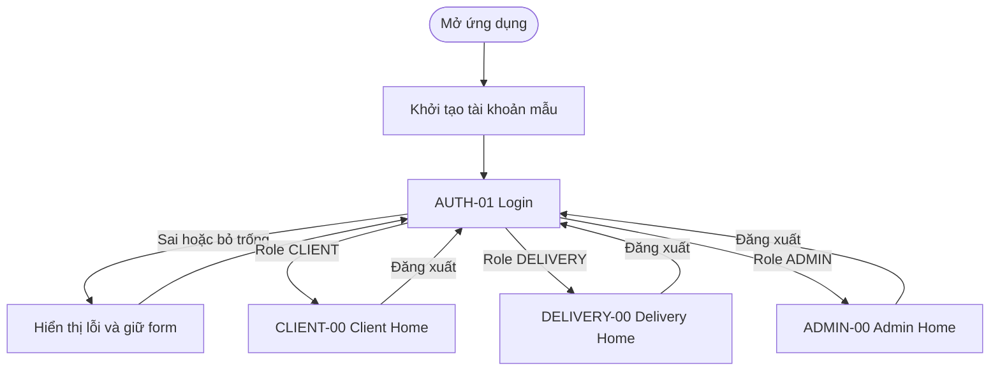

# GoDrop — Prototype tổng

## Mục tiêu

Prototype chứng minh một luồng hoàn chỉnh từ Login đến đúng Home theo role. Phần Home
chỉ mô tả khung điều hướng và vùng nội dung; nghiệp vụ sâu thuộc các feature riêng.

## Screen inventory

| ID | Màn hình | Thành phần bắt buộc | Nhánh cung cấp nội dung |
|---|---|---|---|
| AUTH-01 | Login | Logo, số điện thoại, mật khẩu, ẩn/hiện, quên mật khẩu, đăng nhập | `feature/auth-navigation` |
| CLIENT-00 | Client Home shell | Role header, 4 navigation item, vùng nội dung khách hàng, logout | `feature/client-request` |
| DELIVERY-00 | Delivery Home shell | Role header, trạng thái trực tuyến, 4 navigation item, logout | `feature/delivery-orders` |
| ADMIN-00 | Admin Home shell | Role header, số liệu tổng quan, 4 navigation item, logout | `feature/auth-navigation` + data integration |

## Luồng prototype

## Trạng thái Login

1. `Initializing`: nút đăng nhập bị khóa và hiển thị tiến trình.
2. `Idle`: người dùng có thể nhập số điện thoại và mật khẩu.
3. `Validation error`: form báo thiếu trường.
4. `Authentication error`: thông báo số điện thoại hoặc mật khẩu không đúng.
5. `Success`: điều hướng theo role và không cho chọn role thủ công.

## Tài khoản demo

Mật khẩu chung: `123456`.

| Role | Số điện thoại |
|---|---|
| CLIENT | `0123456789` hoặc `0987654321` |
| DELIVERY | `0111222333` hoặc `0444555666` |
| ADMIN | `0000000000` |

## Tiêu chí nghiệm thu

- Không thể đăng nhập khi dữ liệu mẫu chưa khởi tạo xong.
- Mỗi tài khoản đi đến đúng Home theo role trong database.
- Không có nút chọn role trên Login.
- Đăng xuất ở cả ba Home quay về Login.
- Login runtime dùng XML và được nhúng vào app Compose qua `AndroidView`.
- Login Compose tham chiếu và bản XML dùng cùng màu, typography và kích thước chính.
- Màn hình hoạt động ở 360×800 dp và 390×844 dp mà không bị cắt nội dung.
